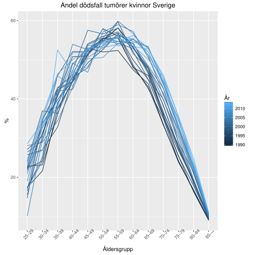

Tidigare i år publicerades en studie av en svensk forskargrupp om samband mellan solvanor och dödlighet [@JOIM:JOIM12496]. Nu i veckan publicerade också Pelle Lindqvist och Håkan Olsson, två av författarna bakom studien, en artikel på SVT Opinion [@lindqvist1606], vilket föranlett en liten studiodebatt mellan Lindqvist, och hudläkaren Ada Girnita [@gronberg1606]. I studien rekryterades i början av 90-talet 29\ 518 kvinnor utan rapporterad cancer i åldern 25--64 år, vilka sedan följdes i upp till 20 år. Nu har det visat sig att de kvinnor som rapporterade låg solexponering, baserat på fyra frågor, har förhöjd dödlighet jämfört med de som rapporterade hög solexponering. Detta har föranlett Lindqvist och Olsson att ge rådet att "[s]ola lagom varje dag": de framhåller att risken för melanom ökar när folk bränner sig eller är ute länge med solkräm, som de hävdar "tar bort hudens reaktion på för mycket sol, men inte skyddar nämnvärt mot melanom".

Under studiodebatten hävdar sedan Girnita att det bland kvinnorna i studien inträffade "14 fall av melanom i gruppen som inte solar och 126 i gruppen som solar". Den jämförelsen är inte speciellt klargörande eftersom antalet inte normaliserats till gruppernas storlek. Det var 1721 kvinnor i gruppen med lägst exponering (som svarade nej på alla fyra solfrågorna) och 11\ 631 kvinnor i gruppen med högst exponering (som svarade ja på tre eller fyra frågor). Så melanomrisken var 0,8 och 1,1 procent i de båda grupperna -- en skillnad som inte är statistiskt signifikant, enligt beräkningarna i studien.^[Professorn i vårdvetenskap Yvonne Brandberg gör samma jämförelse i en radiodebatt med Lindqvist [@studioett1606]. Märkligt nog bemöter denne inte påståendet i något av fallen.] Dessutom förnekar som sagt inte författarna att sol kan påverka risken för melanom under vissa omständigheter.

Girnita är också inne på att den minskade dödligheten bland de som solar mer kan förklaras av att de är mer fysiskt aktiva och bättre utbildade. Det ter sig som en mer relevant kritik. Två av de fyra solfrågorna handlar om benägenheten att åka på semester, så det är inte konstigt att det uppstått snedvridning genom socioekonomiska faktorer. Kvinnorna har delats in i 10-åriga åldersintervall, i fyra grupper med olika utbildningsnivå (plus gruppen "other") och tre inkomstklasser. I lågexponeringsgruppen tillhörde 43,1 procent den lägsta utbildningsgruppen (högst 9 års skola), 58,7 procent det högsta åldersintervallet (55--64 år) och 45,7 procent den lägsta inkomstklassen. I högexponeringsgruppen var dessa andelar 10,9, 13,9 och 14,8 procent. Det fanns en också en variabel för "komorbiditet", vilket definierades som att kvinnorna behandlats med läkemedel mot diabetes eller sjukdom i cirkulationsorganen under mer än en månad. Denna faktor förelåg hos 20,4 procent i lågexponeringsgruppen jämfört med 6,7 procent i högexponeringsgruppen.

Författarna har försökt justera för dessa riskfaktorer. I en modell med enbart justering för åldersgrupp var hazardkvoten för totaldödlighet 0,5 för högexponering relativt lågexponering. När även rökning, utbildning, civilstånd, inkomst och komorbiditet inkluderades var den 0,6 och när fysisk aktivitet inkluderades var den 0,7. Frågan är om denna justering är tillräcklig eller om det finns kvarstående snedvridning. Indelningen i t.ex.\ åldersintervall och inkomstnivåer är som sagt ganska grov.

@JOIM:JOIM12496 innehåller diagram som visar fördelningen av dödsorsaker bland kvinnorna i det högsta åldersintervallet (icke-rökare utan komorbiditet i den mellersta inkomstgruppen). De dödsorsaksgrupper som finns med är cancer, cirkulationssjukdom och övriga dödsorsaker. Här går det att se en skillnad mellan de olika solgrupperna: cancer var mindre vanligt relativt andra dödsorsaker bland kvinnor i lågexponeringsgruppen. Detta kan tolkas som att det finns kvarstående snedvridning genom ålder och socioekonomiska faktorer. För det första är det så att andelen dödsfall som beror på cancer minskar med stigande ålder efter 65-årsåldern. Under uppföljningsåren ökade också andelen i åldersgrupper under 85 år (där alla dödsfall i denna studie inträffade), till följd av kraftigare nedgång av dödstalen i cirkulationssjukdom (se diagram). Dessutom är det så att lågutbildade, jämfört med högutbildade, länge haft en mindre kraftig relativ ökning av dödstalen i cancer än i andra dödsorsaker före 80 års ålder [@dorutb9214].

Så om de 55--64-åriga kvinnorna i lågexponeringsgruppen tenderade att vara närmare 65 än 55 år vid studiens början och dessutom var socioekonomiskt missgynnade, och det motsatta gällde för kvinnorna i högexponeringsgruppen, skulle vi vänta oss att de förstnämnda kvinnorna hade högre total dödlighet och lägre andel cancerdödsfall till följd av flera faktorer. Förutom deras högre ålder och lägre socioekonomiska status tillhörde de också en äldre födelsekohort och uppnådde därmed en viss ålder vid ett tidigare kalenderår, när andelen cancerdödsfall vid den åldern var lägre och den totala dödligheten högre.

## Referenser
