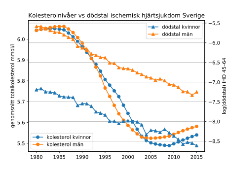

I förra veckan publicerades en artikel i NEJM baserad på material från Global
burden of disease om hälsoeffekter av övervikt och fetma i olika länder i
världen 1990--2015 [@gbd15obesity195]. Föga förvånande har den blivit
uppmärksammad i en Bojskrönika i DN [@bojs170618]. Ett centralt fynd är att
högt BMI orsakade 4 miljoner dödsfall globalt under 2015. Metodologin i studien
är i princip densamma som i tidigare GBD-studier av effekterna av riskfaktorer,
som den jag diskuterade [den 12 september
2015](http://klpn.se/2015/09/12/vaxande-borda/). Tidigare publicerade studier
används för att beräkna den fördelning av riskfaktorer som skulle ge bäst
generell hälsa. Här antas BMI på 20--25 ge lägst total dödlighet, vilket
baseras på data från livslånga icke-rökare där de som dött under de första
uppföljningsåren uteslutits (vilket motverkar sådan problematik i beräkningar
av samband mellan BMI och hälsoutfall som jag skrev om [den 24 juni
2016](2016-06-24-smuts.html)). Sedan har fördelningen av avvikelser från detta
ideal och orsaker till sjuklighet och dödlighet i de olika befolkningarna vägts
mot risk- eller hazardkvoter för dessa hälsoproblem med ökande BMI.

Omkring 60 procent av dödsfallen till följd av högt BMI 2015 ägde rum i personer med
fetma, definierat som BMI på minst 30. Artikeln innehåller kartor som visar
åldersstandardiserad prevalens av fetma bland kvinnor och män i olika länder. Kanske
föga överraskande är prevalensen låg i större delen av Afrika och Östasien och
hög i USA, Mellanöstern och många önationer i Oceanien. Allmänt ökar den med
stigande välstånd och är generellt något högre bland kvinnor än bland män, även i
Sverige, även om lättare övervikt, definierat som BMI 25--29, är vanligare bland män.

Prevalensen av fetma har ökat i de flesta delar av världen sedan 1990, men
samtidigt har åldersstandardiserade dödstal relaterade till fetma inte ökat
globalt. Baslinjen, "risk-deleted death rate", för exempelvis kranskärlssjukdom
har minskat, speciellt i rikare länder. I artikelns supplement finns kartor som
visar åldersstandardiserade dödstal och DALY-tal (förlust av friska levnadsår) för
högt BMI. En hastig blick på dessa kartor och de i huvudartikeln visar att det
inte finns något enkelt samband mellan dessa tal och prevalensen av fetma:
vissa länder har höga dödstal eller DALY-tal trots låg prevalens av fetma och
tvärtom. Data över utvecklingen av prevalensen av fetma finns tillgängliga via
@gbd15cov, och data över dödsfall relaterade till högt BMI via @gbd15results.
Dessa kan plottas mot varandra med nedanstående Juliakod.

``` {.julia .numberLines}
using DataFrames, PyCall, PyPlot
PyDict(matplotlib["rcParams"])["axes.formatter.use_locale"] = true
obes = readtable("data/IHME_GBD_2015_COVARIATES_1980_2015_PREV_OBESITY_AGESTD_Y2016M10D07.CSV")
obes15 = obes[obes[:year_id].==2015, :]
morthibmi15 = readtable("data/IHME-GBD_2015_DATA-b1dd7050-1.csv")
rename!(obes15, Dict(:sex_id => :sex, :location_id => :location))
obes_morthibmi15 = join(obes15, morthibmi15, on =  [:location, :sex])
obes_morthibmi15f = obes_morthibmi15[obes_morthibmi15[:sex].==2, :]
obes_morthibmi15m = obes_morthibmi15[obes_morthibmi15[:sex].==1, :]
scatter(obes_morthibmi15f[:val], obes_morthibmi15f[:val_1],
	label = "kvinnor", alpha = 0.5)
scatter(obes_morthibmi15m[:val], obes_morthibmi15m[:val_1],
	label = "män", alpha = 0.5)
grid(1)
xlabel("Åldersstandardiserad andel med BMI\u226530")
ylabel("Åldersstandardiserade dödsfall/100 000 för högt BMI")
legend()
title("Prevalens fetma vs dödstal genom högt BMI 2015")
```

Diagrammet som denna kod genererar bekräftar att det inte är något speciellt
starkt samband.


Det som förklarar variationer mellan länder i fråga om dödlighet på grund av
högt BMI, efter justering för ålder, är inte så mycket
prevalensen av fetma som baslinjedödlighet i sjukdomsgrupper där övervikt eller
fetma är en riskfaktor. Så är exempelvis prevalensen av fetma bland kvinnor i
Sverige 19 procent, jämfört med 3 procent bland kvinnor i Etiopien. Men dödstal
genom högt BMI bland kvinnor är 30/100\ 000 i Sverige och 50/100\ 000 i
Etiopien. Vid en given BMI-nivå är dödligheten i exempelvis
cirkulationssjukdomar mycket högre i Etiopien än i Sverige (vilket kan bero på
dåligt utvecklad sjukvård och på andra faktorer utom BMI som
påverkar både insjuknande och överlevnad bland de drabbade). Om de relativa
dödstalen för feta jämfört med normalviktiga är samma i Sverige som i Etiopien
(vilket antagits i modellerna som ligger till grund för studierna, där relativa
döds- och insjuknandetal för olika sjukdomar bara kan variera med kön och
ålder) kommer då fetman att medföra en större dödlighetsökning i absoluta tal i
Etiopien.

En sak relaterad till detta är att tal av typen "riskfaktor $x$ gör att det dör
$y$ fler personer i befolkning $A$ än $B$" får olika innebörd beroende på
riskfaktorn sätts i en kontext med övriga riskfaktorer i $A$ eller $B$. Sedan
början av 1980-talet har exempelvis dödstalen i kranskärlssjukdom i
åldersgrupperna under 75 år minskat med mer än 80 procent i Sverige. Olika
undersökningar pekar på att nivåerna av kolesterol i Sverige sjunkit under
åtminstone delar av denna period, och det har framhållits som en viktig faktor
bakom nedgången [@sos2009f2, s. 221]. Även sammanställningar av utvecklingen av
kolesterolnivåer i Sverige är tillgängliga via @gbd15cov. Nedanstående Juliakod
ritar upp ett diagram över dessa nivåer jämfört med genomsnittet av dödstalen i
kranskärlssjukdom i åldersgrupperna 45--64 år (med hjälp av [mitt
Mortchartgen-paket](https://github.com/klpn/Mortchartgen.jl), baserat på data
från @whomort). 

``` {.julia .numberLines}
using DataFrames, PyCall, PyPlot, Mortchartgen
PyDict(matplotlib["rcParams"])["axes.formatter.use_locale"] = true
chol = readtable("data/IHME_GBD_2015_COVARIATES_1980_2015_MEAN_CHOLESTEROL_Y2016M10D07.CSV")
frames = Mortchartgen.load_frames()
ihdsv = Mortchartgen.propplot_sexesyrs("ihd", "pop", [2;1], 4290, 15, 18,
	1980:2015, true, frames, "sv", "/tmp/mout.html", false)
cholfse = chol[((chol[:location_id].==93)&(chol[:sex_id].==2)), :]
cholmse = chol[((chol[:location_id].==93)&(chol[:sex_id].==1)), :]
fig, axc = plt[:subplots]()
axc[:plot](cholfse[:year_id], cholfse[:val], "-o", label = "kolesterol kvinnor")
axc[:plot](cholfse[:year_id], cholmse[:val], "-o", label = "kolesterol män")
axc[:set_ylabel]("genomsnitt totalkolesterol mmol/l")
axc[:legend](loc=3)
axi = axc[:twinx]()
axi[:plot](cholfse[:year_id], log(ihdsv[2][:propframe][:value]), "-^",
	label = "dödstal kvinnor")
axi[:plot](cholfse[:year_id], log(ihdsv[1][:propframe][:value]), "-^",
	label = "dödstal män")
axi[:set_ylabel]("log(dödstal) IHD 45\u201364")
axi[:legend](loc=1)
grid(1)
title("Kolesterolnivåer vs dödstal ischemisk hjärtsjukdom Sverige")
```

Denna kod genererar nedanstående diagram, som visar en minskning på ca 0,5
mmol/l 2015 jämfört med 1980. Minskningen tycks dock i huvudsak ha varit
koncentrerad till 1990-talet, samtidigt som nedgången av kranskärlsdödlighet
pågått kontinuerligt sedan början av 1980-talet (och ännu längre bland
kvinnor).



Om dessa förändringar på befolkningsnivå antas ha sådana relativa effekter i
olika åldersgrupper som visats i prospektiva studier av individer skulle en
minskning av kolesterolet med 0,5 mmol kunna innebära en minskning av
kranskärlssjukdom med 17 procent bland 55--64-åringar och 11 procent bland
65--74-åringar (baserat på poolade uppskattningar från @plosmeta13). Den förra
siffran skulle förklara drygt 20 procent av en 80-procentig nedgång i denna
grupp från 1980. Men om vi ställer oss frågan vad som skulle hända om nivåerna
åter ökade med 0,5 mmol med 2015 års nivåer av övriga riskfaktorer, skulle det,
med samma relativa tal, innebära en ökning från 20 till 24 procent av dödstalen
1980 och alltså tillintetgöra 5 procent av nedgången för hela perioden.

##Referenser
