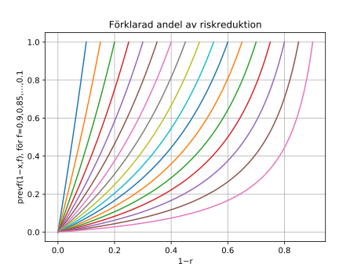

I slutet av förra inlägget diskuterade jag hur riskfaktorer som multipliceras
med en viss risk (eller hazard) bland oexponerade i fall där två befolkningars
risk skiljer sig på grund av flera faktorer kan få olika stora effekter,
i absoluta tal, beroende på relativt vilken befolkning effekterna mäts. Jag gav
ett exempel med minskningar av kolesterolnivåer och kranskärlssjukdom i Sverige.
Resonemanget kan, mer generellt, tillämpas i följande typ av situationer.

1. Risken i en befolkning $B$ är $f$ procent av risken i en befolkning $A$.
2. Gynnsammare nivåer av en viss faktor i $B$ jämfört med $A$ ger en riskkvot
   $r$.

I så fall kan vi definiera $\text{excf}(r,f)=(1-r)/(1-f)$ som den andel av överrisken
i $A$ jämfört med $B$ som förklaras av de mindre gynnsamma nivåerna i $A$. Om
kolesterolnivåerna bland medelålders svenskar sjunkit med 0,5 mmol/l och det
antas reducera dödstalen i kranskärlssjukdom med 16 procent och dessa dödstal
sjunkit med 80 procent sedan 1980 gäller att den andel av överdödligheten 1980,
jämfört med idag, som kan förklaras av högre nivåer är
$\text{excf}(0\text{,}84,0\text{,}2)$, ca 20 procent, som i exemplet i förra inlägget.
Men är vi intresserade av den andel av den reducerade risken i $B$ som
förklaras av de gynnsammare nivåerna där ges den av 
$\text{prevf}(r,f) = (1/r-1)/(1/f-1)$. I det aktuella exemplet gäller att
$\text{prevf}(0\text{,}84,0\text{,}2)$ är knappt 5 procent. Nedanstående
Juliakod ritar upp ett diagram som visar förhållandet mellan riskreduktioner för
en viss riskfaktor och den, i den senare meningen, förklarade andelen för totala
riskreduktioner mellan 10 och 90 procent.

``` {.julia .numberLines}
using PyCall, PyPlot
prevf(r,f) = (1/r-1)/(1/f-1)
for invf in 10:5:90
	invrs = (0:invf)/100
	plot(invrs, map((invr)->prevf(1-invr,1-invf/100), invrs))
end
xlabel("1\u2212r")
ylabel("prevf(1\u2212x,f), för f=0,9,0,85,\u2026,0.1")
grid(1)
title("Förklarad andel av riskreduktion")
```



@bjorck09 söker modellera olika riskfaktorers och behandlingars bidrag till
minskningen av kranskärlsdödlighet bland svenskar perioden 1986--2002. Studien
fick viss uppmärksamhet i media (som jag skrev om [den 23 september
2013](http://diversepedanteri.blogspot.se/2013/09/mattade-svenskar.html)). Det
absoluta antalet dödsfall som förebyggs genom reduktioner av en riskfaktor
under tidsperioden beräknas med formeln $(1-r)\times n_{86,k,a}$ där $n_{86,k,a}$ är
antalet dödsfall 1986 för kön $k$ och åldersgruppen $a$. I ett exempel de ger
hade det skett minskningar av blodtrycket bland kvinnor i åldern 55--64 år
som motsvarar en reduktion på ca 8 procent, och i den gruppen inträffade 570
dödsfall 1986. Därmed "förebygger" det sänkta blodtrycket 46 dödsfall i
gruppen, enligt vad som sägs i artikeln.

Men den fråga beräkningen besvarar handlar snarare om hur mycket överdödlighet
1986 som orsakades av förhöjda blodtrycksnivåer, relativt 2002. Om det skall
formuleras i termer av att "förebygga" blir det en kontrafaktisk fråga: hur
många dödsfall 1986 *skulle* ha förebyggts om just denna riskfaktor sänkts till
2000-talets nivåer? Är vi intresserade av att ta reda på hur många dödsfall som
faktiskt förebyggdes av de sänkta nivåerna 2002 kan det beräknas enligt
$1/r\times n_{02,k,a}-n_{02,k,a}$. Andelen kvinnor i åldersgruppen 55--64 år
med kranskärlssjukdom (ICD-10 I20--I25) som underliggande dödsorsak var 291 år
2002, enligt data tillgängliga via @whomort. Det innebär att ca 25 färre
dödsfall inträffade än vad som skulle ha inträffat utan en reduktion av den
aktuella storleken. Det är väl, i vanligt språkbruk, innebörden av att faktiskt
förebygga dödsfall som annars hade inträffat, snarare än kontrafaktiskt
förebygga dödsfall som faktiskt inträffat?

## Referenser
