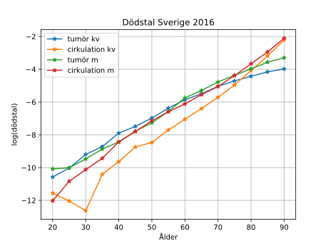

Häromdagen publicerades dödsorsaksstatistik för Sverige 2016 [@sosdorstat16].
Den sammanfattas i ett faktablad på fyra sidor. På första sidan finns en tabell
som visar dödstal och medianålder för dödsfall för olika dödsorsaker på
kapitelnivå i ICD-10. När jag öppnade bladet såg jag direkt att det var fel:
medianålder för dödsfall i tumörer skulle t.ex.\ ha varit 88 år bland kvinnor och 82
år bland män. Jag skrev till Socialstyrelsen om detta, och de lade snabbt ut
ett korrigerat faktablad. De medianåldrar som först uppgavs för tumörer gäller
cirkulationssjukdom, och för tumörer är den korrekta åldern 76 år för båda
könen.

Det är just denna egenskap hos cancerdödligheten, att den åldersrelaterade
ökningen bromsas upp med stigande ålder, så att åldersfördelningen är
förskjuten till vänster jämfört med dödligheten i stort, som gör att de senaste
decenniernas ökade medellivslängd genom framför allt minskning av
kranskärlssjukdom inte lett till att andelen av alla dödsfall som orsakas av
cancer ökar dramatiskt. Bland kvinnor är denna andel 24 procent, och den låg på
23--24 procent redan under stora delar av 1970-talet (se
[Mortalitetsdiagram](http://mortchart.klpn.se/charts/tumall4290s1e1meanfalse.html)).
Den var något lägre under större delen av 1980- och 1990-talen, vilket kan
förklaras av regler som innebar minskad benägenhet att rapportera cancer som
underliggande dödsorsak bland äldre [@scbdor81, s. 10]. Bland män har det skett
en något större ökning, från ca 22 till nära 28 procent de senaste åren, vilket
har att göra med att minskad icke cancerrelaterad dödlighet före 75 års ålder
haft större betydelse för ökningen av männens livslängd. Det går att se ett
liknande mönster i exempelvis USA, där andelen dödsfall i cancer varit närmast
konstant sedan 1980-talet. [Den 25 augusti förra året](2016-08-25-rates.html)
skrev jag om en Voxartikel om amerikanska trender för cancer och hjärtsjukdom
som ignorerar dessa mönster och även innehåller en del andra förvirringar.
Vissa länder, som Danmark, har haft en kraftigare ökning av andelen dödsfall i
cancer, så att cancer där blivit vanligare som dödsorsak än
cirkulationssjukdom, men Danmark har kortare medellivslängd än Sverige, bl.a.\ genom
höga dödstal i lungcancer.

I inlägget från förra året tog jag också upp de åldersintervall som används i den
officiella svenska statistiken, och det är något som inte förändrats sedan
dess. Den via webben tillgängliga statistikdatabasen för dödsorsaker har, som
Socialstyrelsens övriga statistikdatabaser, 85-- år som öppet intervall, vilket
motsvarar medianåldern för total dödlighet bland kvinnor. Den innehåller också
bara ICD-koder på tredjepositionsnivå. I den statistik som exporteras till
@whomort finns koder på den nedersta fjärdepositionsivån, och 95-- år öppet
intervall, men den släpar efter med publiceringen. Den Excelfil som ingår i
publiceringen på @sosdorstat16 innehåller en tabell 4A med 90-- år som öppet
intervall och ICD-koder på fjärdepositionsnivå. Jag har omvandlat den tabellen
till en datafil lämpad för automatiserad analys genom att exportera den som CSV
och sedan stuva om denna CSV-fil med hjälp av följande AWK-kod: 

``` {.awk .numberLines}
#!/usr/bin/awk -f
BEGIN { 
	RS = "\n" 
	FS = "," 
}

{
	gsub(/\x22|,\s|\s|\xc2\xa0/, "")
}

NR == 1 { 
	printf("icd10,sex,age,n\n") 
}

NR > 5 && $5 != "" { 
	if ($1=="") {$1=previcd}
	previcd = $1
	for (i=0; i<=20; i++) {
		c=i+4
		printf("%s,%s,%d,%d\n",$1,$3,i,$c)
	}
}
```

Om tabellen har sparats som `2017-9-10-4A.csv` och AWK-koden som `sedor.awk`
kan en modifierad fil `2017-9-10-4Amod.csv` skapas genom att i en terminal köra
`./sedor.awk < 2017-9-10-4A.csv > 2017-9-10-4A.csv`. Filen har följande
format, med fält för ICD-kod, kön, åldersgrupp och antal döda.

```
icd10,sex,age,n
A00-Y98,Kv,0,46586
A00-Y98,Kv,1,136
A00-Y98,Kv,2,29
...
A00-Y98,M,18,7239
A00-Y98,M,19,7756
A00-Y98,M,20,7533
A00-B99,Kv,0,1064
```

Vill vi beräkna dödstal behövs också data över medelfolkmängden under året,
vilket kan hämtas via @scbmf. Om en relationstabell med data för kvinnor och
män 2016 i ettårsklasser laddats ned kan den också överföras till hanterbart
format med AWK:

``` {.awk .numberLines}
#!/usr/bin/awk -f
BEGIN { 
	RS = "\r\n" 
	FS = "\t"
	fpop = 0
	mpop = 0
}

NR == 1 {
	printf("sex,age1,n\n")
}

NR > 1 {
	gsub(/\sår|\+/, "")
	gsub(/kvinnor/, "Kv")
	gsub(/män/, "M")
	if ($2 == "M")
		mpop += $4
	else
		fpop += $4
	printf("%s,%d,%s\n",$2,$1+1,$4)
}

END {
	printf("%s,%d,%f\n%s,%d,%f","Kv",0,fpop,"M",0,mpop)
}
```

Jag har skapat en
[gist](https://gist.github.com/klpn/8a9939cf6ffb0a186eb244bc1c18f553) 
med funktioner i Julia, som exemplifierar hur dessa
filer kan analyseras. Nedanstående kod ritar upp ett diagram över dödstalen i
tumörer och cirkulationssjukdom i relation till ålder.

``` {.julia .numberLines}
using PyPlot
include("sedor.jl")
tum = Dict(:expr => "C00-D48", :alias=> "tumör")
circ = Dict(:expr => "I00-I99|F01", :alias=> "cirkulation")
for sex in ["Kv"; "M"]
	for cadict in [tum; circ]
		df = propframe(sex, cadict[:expr], "pop")[:frame]
		plot(df[:agest][7:21], log(df[:prop][7:21]), "-*", 
			label="$(cadict[:alias]) $(lowercase(sex))")
	end
end
grid(1)
xlabel("Ålder")
ylabel("log(dödstal)")
title("Dödstal Sverige 2016")
legend()
```



Diagrammet visar som synes hur ökning av tumördödligheten, till skillnad från
cirkulationsdödligheten, planar ut i högre åldersgrupper.

## Referenser
